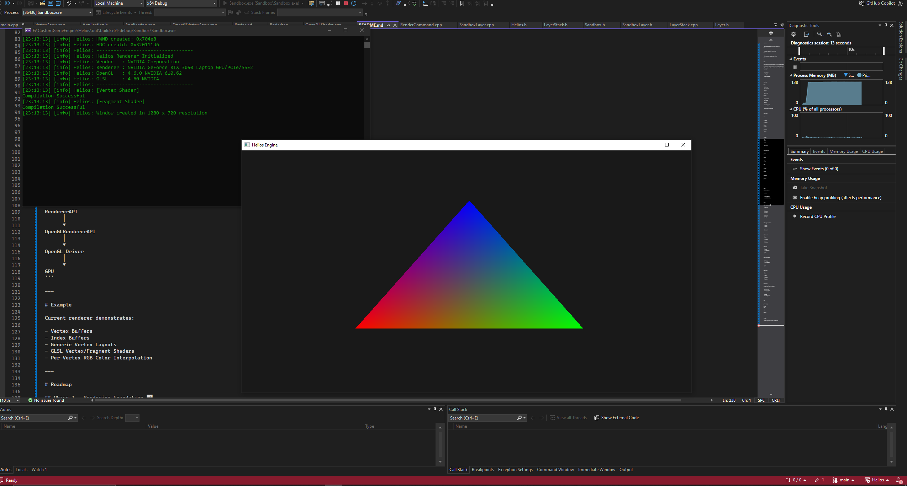

# Helios Engine

<p align="center">
  
</p>

<p align="center">
  <strong>A modern C++ Game Engine built from scratch.</strong>
</p>

<p align="center">
  Built for learning, graphics programming, and engine architecture.
</p>

---

## About

Helios is a custom game engine written entirely in modern C++ with a strong focus on understanding how professional game engines are built from the ground up.

The goal of this project is not only to render graphics, but to gradually develop a complete engine capable of creating interactive applications and games while exploring the internal architecture behind commercial engines.

This project emphasizes:

- Modern C++ design
- Rendering architecture
- Graphics programming
- Engine abstractions
- Performance-oriented development
- Clean and scalable codebase

---

# Current Features

### Core

- Win32 Window System
- Modern C++20 Architecture
- Logging System (spdlog)
- Layer System
- Layer Stack
- Application Framework

### Rendering

- OpenGL 4.6 Core Renderer
- Rendering API Abstraction
- Render Command Queue
- Vertex Buffers
- Index Buffers
- Vertex Arrays
- Generic Buffer Layout System
- Shader Abstraction
- External GLSL Shader Loading
- RGB Triangle Rendering using Vertex Attributes

---

# Project Structure

```
Helios/
│
├── Engine/
│   ├── Include/
│   ├── Source/
│   └── ThirdParty/
│
├── Sandbox/
│   ├── Assets/
│   └── Source/
│
├── CMakeLists.txt
└── README.md
```

---

# Technologies

- C++20
- OpenGL 4.6
- GLAD
- Win32 API
- CMake
- Visual Studio 2022

---

# Current Rendering Pipeline

```
Application
      │
      ▼
LayerStack
      │
      ▼
Sandbox Layer
      │
      ▼
Renderer
      │
      ▼
RenderCommand
      │
      ▼
RendererAPI
      │
      ▼
OpenGLRendererAPI
      │
      ▼
OpenGL Driver
      │
      ▼
GPU
```

---

# Example

Current renderer demonstrates:

- Vertex Buffers
- Index Buffers
- Generic Vertex Layouts
- GLSL Vertex/Fragment Shaders
- Per-Vertex RGB Color Interpolation

---

# Roadmap

## Phase 1 — Rendering Foundation ✅

- [x] Window Creation
- [x] OpenGL Context
- [x] Renderer API
- [x] Render Commands
- [x] Vertex Buffers
- [x] Index Buffers
- [x] Vertex Arrays
- [x] Buffer Layouts
- [x] Shader System
- [x] RGB Triangle

---

## Phase 2 — Engine Core (In Progress)

- [x] Event System
- [ ] Input System
- [ ] Time Step
- [ ] Camera
- [ ] ImGui Integration

---

## Phase 3 — Graphics

- [ ] Textures
- [ ] Materials
- [ ] Uniform Buffers
- [ ] Mesh Loading
- [ ] Model Loading

---

## Phase 4 — Scene

- [ ] Scene Graph
- [ ] Entity Component System
- [ ] Serialization
- [ ] Prefabs

---

## Phase 5 — Advanced Rendering

- [ ] Lighting
- [ ] Shadow Mapping
- [ ] Physically Based Rendering
- [ ] HDR
- [ ] Bloom
- [ ] Skybox

---

## Phase 6 — Engine

- [ ] Physics
- [ ] Audio
- [ ] Animation
- [ ] Editor
- [ ] Asset Pipeline
- [ ] Project System

---

## Long-Term Vision

Helios aims to become a lightweight game engine capable of:

- Creating standalone games
- Creating reusable projects
- Native C++ gameplay programming
- Modern rendering techniques
- Editor tools
- Asset management
- Cross-platform support (future)

---

# Build

```bash
git clone <repository>

mkdir build
cd build

cmake ..

cmake --build .
```

---

# Screenshots

> Screenshots and progress updates will be added as development continues.
<p align="center">
    
</p>
---

